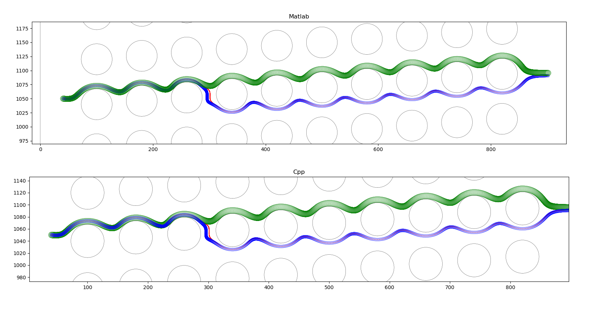

# MOPSA
## Compile
1. `mkdir build`
2. `cd build`
3. `cmake ../`
4. `make -j16`

- The binary location: `binary/`.
### System Requirement
- cmake 3.16
- g++ 9.2.1 
- boost 1.65.1
- OpenMp 4.5

## Add a new design
1. Convert `design.mat` to `deisgn.txt`.
   Since currently cpp is not able to read `design.mat` directly, we have to turn `design.mat` into `txt` format.
   We can use the script, `convert_mat.py`, in the `scripts/`.

   usage: python ./scripts/covert_mat.py <deisgn_folder> <design_name> <ouput_folder>

   > `python ./scripts/convert_mat.py converted_geometry 90um design_geometry_plain`

2. Add a default simulation setting file to `matlab/chip_simulation_setting`.

## Setting parameters

| Parameter          |  Type | Default | Description |
| ------------------ | ------| --------| ----------- |
| **init_x_shift**   | float | None    | Initial x postion shift from 0|
| **init_y_shift**   | float | None    | Initial y postion shift from (design_width/2)|
| **start_vx**       | float | None    | Inital particle velocity in x direction |
| **start_vy**       | float | None    | Inital particle velocity in y direction |
| **dPs**            | List of float | None | The diamters of particle to simulate |
|**resolution**      | float | 1 | Simulation time resolution |
|**boundary_x_ratio** | float |  0.95 | Simulation boundary. When the x position of particle is greater than (design_width * boundary_x_ratio), we stop simulating|
|**boundary_max_timestep**| int | 100000 | The maximum step we simulate|
|**alpha**| float | 1    | Calibration for vx|
|**beta**|  float | 1.45 | Calibration for vy|
|**output_folder**| string| None | A path for dumping the simulation result|
|**dump_debug_file**| boolean | false | Dump the debug file|

### Advance wall effect
| Parameter          |  Type | Default | Description |
| ------------------ | ------| --------| ----------- |
|**use_advance_wall_effect** | boolean | true | Enable advance wall effect|
|**adv_wall_effect_collision_threshold** | float | 0.01 |  |
|**adv_wall_effect_candidate_threshold** | float | 1 | |
|**adv_wall_effec_extra_shift** | float | 0.01 |  |
|**debug_adv_wall_effect_consistency** | boolean | false | dump wall effect debug log in specious steps. Plot it with "plot_debug_advance_collision.py". |

## Run matalb
- Make sure the output folder exists.
  - `mkdir sim_out/80um`
- `cd matlab`
- `../scripts/runMatlab.sh 80um`

## Run cpp
- Make sure the output folder exists.
  - `mkdir sim_out/80um`
- `cp build`
- `../scripts/runMopsa.sh 80um`: This will use the default simulation setting (./matlab/chip_simulation_setting/)
- You can also run with private settting: 
  - `../scripts/runMopsa.sh 80um <private_setting_path>`

## Plot Simulation Result
- `cd scripts/`
- `python plot_sim_result.py 80um`
